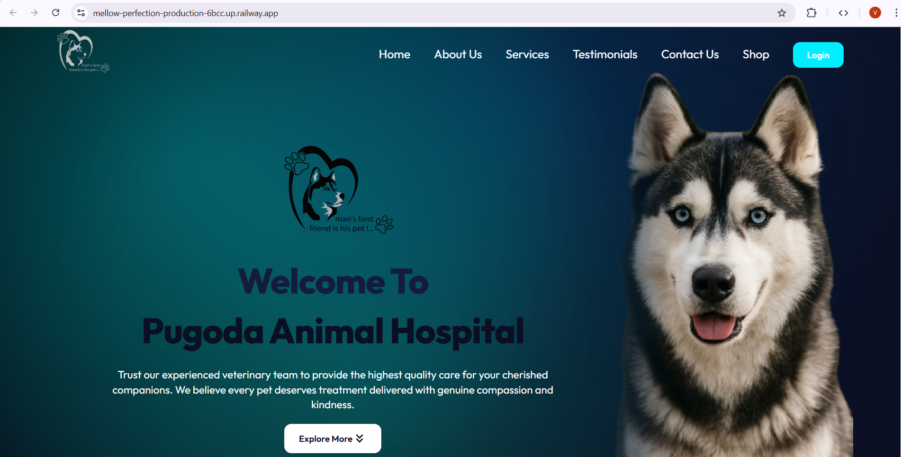
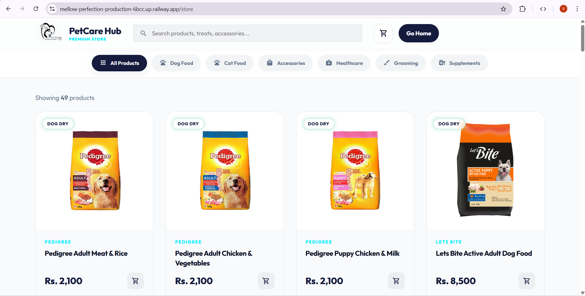
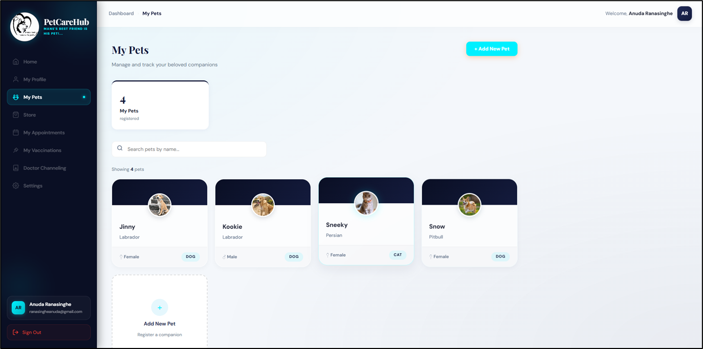
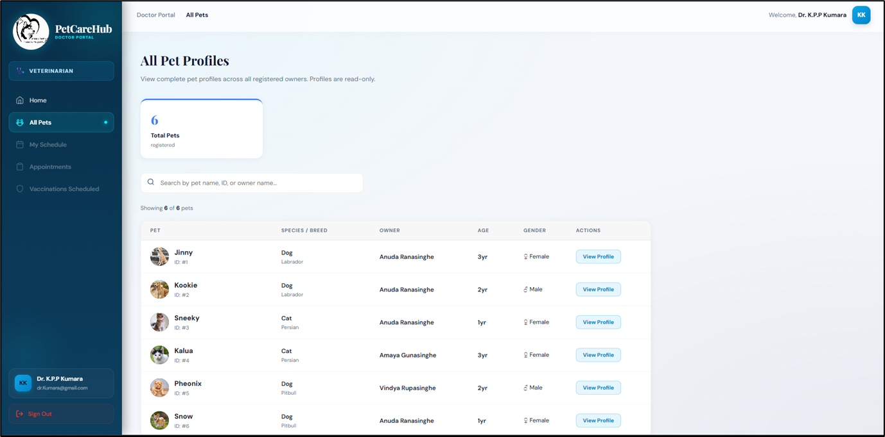
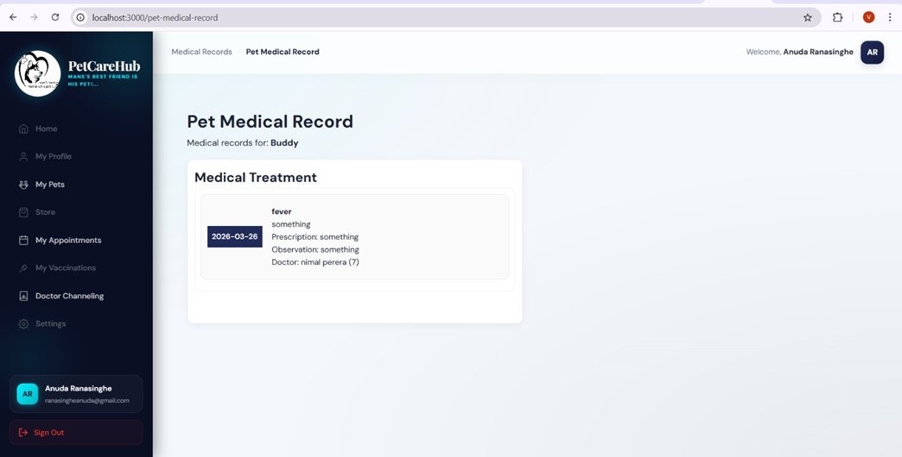
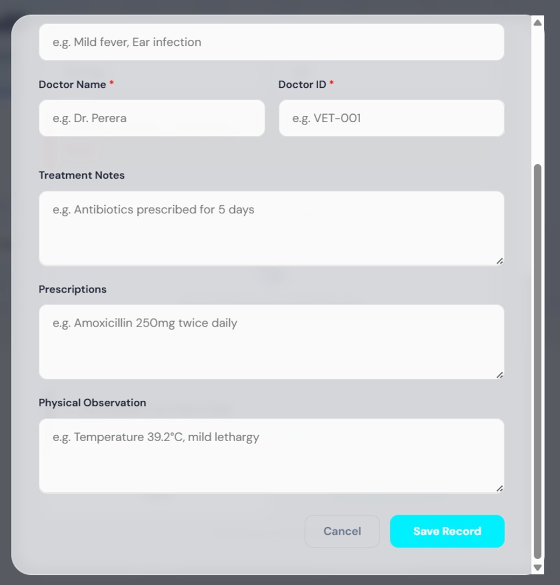

 # PetCareHub

PetCareHub is a web-based system for a veterinary clinic. It is used to manage appointments, pet medical records, vaccinations, and pet store operations in one place.

The system is designed to replace manual processes with something more structured and easier to use for both clinic staff and pet owners.

---

## Why This Project Was Built

The clinic currently uses phone calls, walk-ins, and paper-based records for most of its work.

This causes:
- long waiting times
- difficulty accessing patient information
- repeated questions from customers
- poor coordination between staff

This system was built to centralize everything and reduce these issues.

---

## Problems Addressed

- Appointments are handled manually → leads to overcrowding  
- Medical records are incomplete or hard to access  
- Staff are constantly interrupted with repeated queries  
- Pet owners cannot easily check availability or history  
- Pet store and inventory handling is inefficient  

---

## Technologies Used

Frontend: React (Vite), Axios  
Backend: Spring Boot, Spring Security, JPA / Hibernate  
Database: MySQL  
Authentication: JWT  
Deployment: Railway 

---

## What Was Implemented

- User registration and login with role-based access (Owner, Vet, Staff, Admin)  
- Pet profile management  
- Medical records system (view + update)  
- Appointment booking and management  
- Vaccination reminders  
- Pet store (browse, add to cart, order)  
- Multiple payment methods (card, bank deposit, pay on pickup)  
- Inventory and order management for staff/admin  

---

## How to Run Locally

### Backend

cd petcarehub

Set environment variables:

ADMIN_EMAIL=your_admin_email  
ADMIN_PASSWORD=your_admin_password  

Configure database in application.properties:

spring.datasource.url=jdbc:mysql://localhost:3306/petcarehub  
spring.datasource.username=root  
spring.datasource.password=yourpassword  
spring.jpa.hibernate.ddl-auto=update  

Run:

mvn clean install  
mvn spring-boot:run  

---

### Frontend

cd frontend  
npm install  

Create .env:

VITE_API_BASE_URL=http://localhost:8083  

Run:

npm run dev  

---

## Notes

- Admin account is created automatically using environment variables  
- Product catalog can be seeded during deployment  
- Uploaded files are stored separately (not inside resources)

 
 
 
 
 
 
 
 
 
 